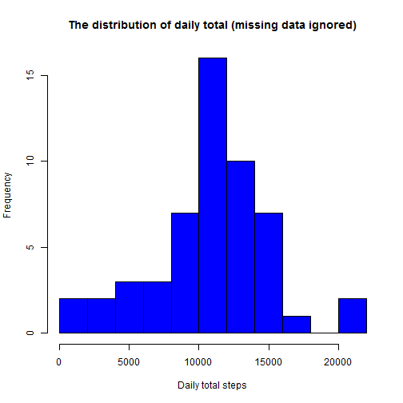
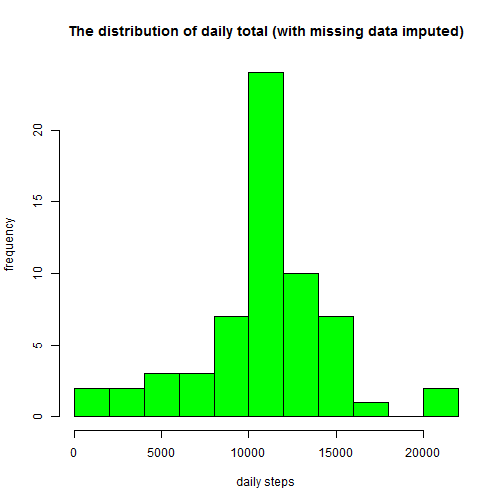
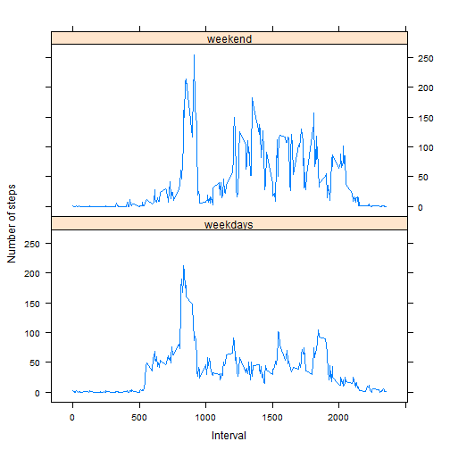

## Loading and preprocessing the data

Firstly, let us read the data.

```r
cls = c("integer", "character", "integer")
df <- read.csv("activity.csv", head=TRUE, colClasses=cls, na.strings="NA")
head(df)
```

```
##   steps       date interval
## 1    NA 2012-10-01        0
## 2    NA 2012-10-01        5
## 3    NA 2012-10-01       10
## 4    NA 2012-10-01       15
## 5    NA 2012-10-01       20
## 6    NA 2012-10-01       25
```

A couple of treatments shall be done.
- transform the date to a proper format
- get rid of missing values


```r
df$date <- as.Date(df$date)
df_nmiss <- subset(df, !is.na(df$steps))
```

## What is mean total number of steps taken per day?

First step: calculate the total number of steps per day, removing missing!

```r
daylys <- tapply(df_nmiss$steps, df_nmiss$date, sum, na.rm=TRUE, simplify=T)
daylys <- daylys[!is.na(daylys)]
```

And now a histogram with the results


```r
hist(x=daylys,
     col="blue",
     breaks=15,
     xlab="Daily total steps",
     ylab="Frequency",
     main="The distribution of daily total (missing data ignored)")
```

 

Mean of total steps per day is 10766 steps/day.

```r
mean(daylys)
```

```
## [1] 10766.19
```


Median of total steps per day is 10.765 steps/day.

```r
median(daylys)
```

```
## [1] 10765
```

## What is the average daily activity pattern?

Below is a time series plot (i.e. type = "l") of the 5-minute interval (x-axis) and the average number of steps taken, averaged across all days (y-axis).


```r
int_avg <- tapply(df_nmiss$steps, df_nmiss$interval, mean, na.rm=TRUE, simplify=T)
df_ia <- data.frame(interval=as.integer(names(int_avg)), avg=int_avg)

with(df_ia,
     plot(interval,
          avg,
          type="l",
          xlab="5-minute intervals",
          ylab="average steps in the interval across all days"))
```

 

Which 5-minute interval, on average across all the days in the dataset, contains the maximum number of steps?


```r
max_steps <- max(df_ia$avg)
df_ia[df_ia$avg == max_steps, ]
```

```
##     interval      avg
## 835      835 206.1698
```

It is the interval 835 that contains maximum number of steps 206 .

## Imputing missing values

1. Calculate and report the total number of missing values in the dataset (i.e. the total number of rows with NAs)


```r
sum(is.na(df$steps))
```

```
## [1] 2304
```
So, we get 2304 rows with missing data.

2. Devise a strategy for filling in all of the missing values in the dataset. The strategy does not need to be sophisticated. For example, you could use the mean/median for that day, or the mean for that 5-minute interval, etc.

The strategy chosen was use of the mean to fill the missing values.


```r
df_impute <- df
ndx <- is.na(df_impute$steps)
int_avg <- tapply(df_nmiss$steps, df_nmiss$interval, mean, na.rm=TRUE, simplify=T)
```

3. Create a new dataset that is equal to the original dataset but with the missing data filled in.


```r
df_impute$steps[ndx] <- int_avg[as.character(df_impute$interval[ndx])]
```

4. Make a histogram of the total number of steps taken each day and Calculate and report the mean and median total number of steps taken per day. Do these values differ from the estimates from the first part of the assignment? What is the impact of imputing missing data on the estimates of the total daily number of steps?

  

```r
new_dailysum <- tapply(df_impute$steps, df_impute$date, sum, na.rm=TRUE, simplify=T)

hist(x=new_dailysum,
     col="green",
     breaks=15,
     xlab="daily steps",
     ylab="frequency",
     main="The distribution of daily total (with missing data imputed)")
```

 

Calculating the new mean and median

```r
mean(new_dailysum)
```

```
## [1] 10766.19
```

```r
median(new_dailysum)
```

```
## [1] 10766.19
```

Our new mean and median values are 10766. So, we can say that the impact of the missing data is minimum, as the mean remains the same and the change in the median is very small.

## Are there differences in activity patterns between weekdays and weekends?

First, let us identify the weekdays and the weekends.


```r
df_impute$wk2 <- as.POSIXlt(df_impute$date)$wday
table(df_impute$wk2)
```

```
## 
##    0    1    2    3    4    5    6 
## 2304 2592 2592 2592 2592 2592 2304
```

If wk2 is 6 or 7 is a weekend.


```r
df_impute$wk <- ifelse(df_impute$wk2 >= 6, 'weekend','weekdays')
table(df_impute$wk)
```

```
## 
## weekdays  weekend 
##    15264     2304
```

Panel plot containing a time series plot (i.e. type = "l") of the 5-minute interval (x-axis) and the average number of steps taken, averaged across all weekday days or weekend days (y-axis)


```r
wk_df <- aggregate(steps ~ wk+interval, data=df_impute, FUN=mean)

library(lattice)
xyplot(steps ~ interval | factor(wk),
       layout = c(1, 2),
       xlab="Interval",
       ylab="Number of steps",
       type="l",
       lty=1,
       data=wk_df)
```

 

From the panel plot analysis we can infere that:

* weekday activities arise earlier than the weekends (around 5~6am) as weekend activities arise around 8am.
* weekend have higher activity from 10am to 5pm.
